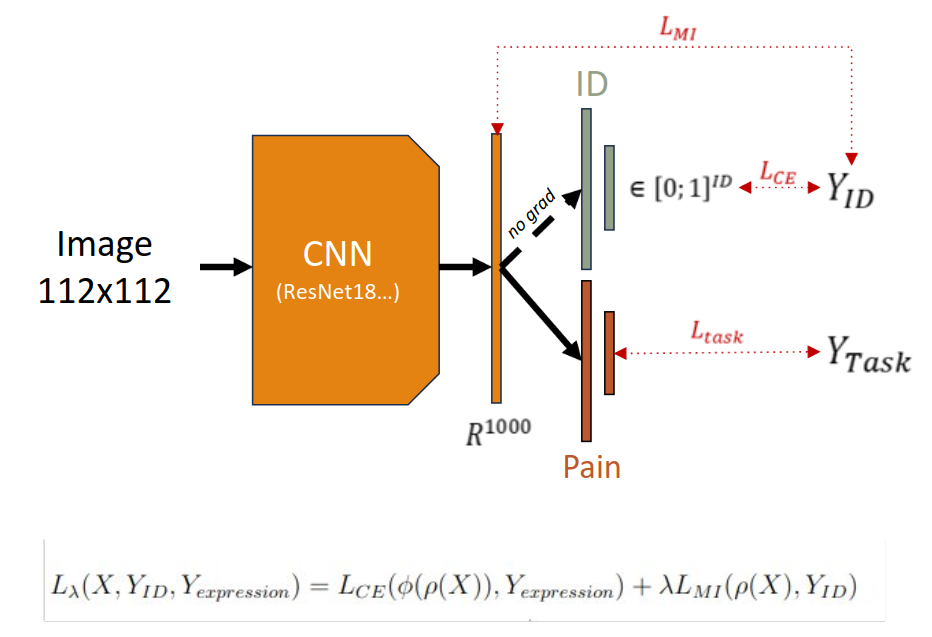

<h1>Disentanglement for pain classification using mutual information with KNIFE estimator</h1>

<h2>Approch</h2>

This work follows on a previous project realised by Rodolphe Nonclerc. It uses an estimator of mutual information proposed by Pichler et al. (2022) 

Pain being a subtle expression facing entanglement issues with identity, with this model we want to separate pain and identity by training a classifier to predict pain while minimizing mutual information between identity and the output features  

  

PICHLER, Georg, COLOMBO, Pierre, BOUDIAF, Malik, et al. KNIFE: Kernelized-Neural Differential Entropy Estimation. 2022.

<h2>Database</h2>

We evaluate the performance of our model using the BioVid Heat Pain Database, a dataset designed for pain recognition research. The database is segmented into five distinct parts, each varying in terms of subjects, labeling, modalities, and tasks.
In our experimentation we use Part A of the dataset, which includes data from 87 subjects, encompassing four pain levels in addition to a neutral state. 
The modalities in Part A consist of frontal video recordings and biological signals. In this study, we concentrate on the highest pain level and the neutral state, using only the frames extracted from the frontal video recordings.

Our experimental protocol consists of a 5-folds cross-validation where training set contains 49 subjects, the validation set contains 12 subjects and the test set 21 subjects.

WALTER, Steffen, GRUSS, Sascha, EHLEITER, Hagen, et al. The biovid heat pain database data for the advancement and systematic validation of an automated pain recognition system. <em>IEEE international conference on cybernetics (CYBCO)</em>. IEEE, 2013. p. 128-131.

<h2>Results</h2>

The results are presented as the average accuracy obtained during the testing phase by the five models trained with each of the five folds.
Two different backbones are used. The fisrt one is the Inception style one proposed by Xie et al. (2020) and the second one is ResNet-18 (He at al. 2016)

<table>
 <thead>
   <tr>
    <th align="center"></th>
    <th align="center">ResNet-18</th>
    <th align="center">Inception style</th>
 </tr>
</thead>
<tbody>
  <tr>
   <td align="center">Baseline</td>
   <td align="center">58.3%</td>
   <td align="center">59.2%</td>
 </tr>
 <tr>
  <td align="center">Disentanlement with TDGAN</td>
  <td align="center">58.9%</td>
  <td align="center">59.7%</td>
 </tr>

</tbody>
</table>

We notice that an improvement is possible with this disentanglement method compared to the baseline with Inception style backbone and ResNet-18 backbone.

HE, Kaiming, ZHANG, Xiangyu, REN, Shaoqing, et al. Deep residual learning for image recognition. In : <em>Proceedings of the IEEE conference on computer vision and pattern recognition.</em> 2016. p. 770-778.

XIE, Siyue, HU, Haifeng, et CHEN, Yizhen. Facial expression recognition with two-branch disentangled generative adversarial network. <em>IEEE Transactions on Circuits and Systems for Video Technology</em>, 2020, vol. 31, no 6, p. 2359-2371.
